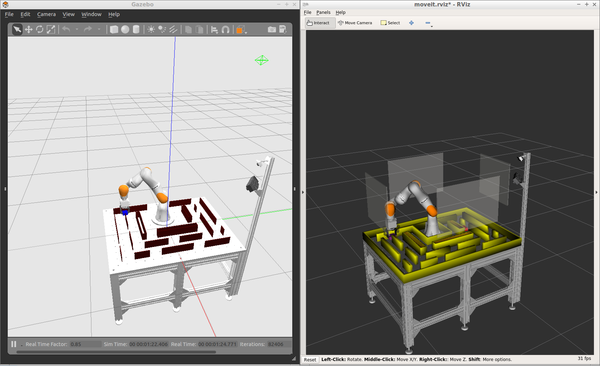

# Path Planning Project

Project for the [path planning challenge](https://blog.udacity.com/2018/08/enter-the-kuka-robotics-challenge.html) in collaboration with KUKA and Udacity

## Goal and Basic Idea

Students learn to implement path planning algorithms by navigating a maze. Usually, path planning problems through mazes are reduced to two dimensions. However, this project will extend the search space by a third dimension, the orientation of the gripper around the vertical z-axis.

An experiment will be executed as follows: first, the robot moves to a start position, which will be the entrance to the maze. There the gripper will pick up an object, that is shaped like a cuboid. Then students will be able to take over and navigate the robot through the maze. They will have to command 2D positions and in order to get around corners, they will have to rotate the cuboid in the corners. They will not be able to get around corners otherwise. Once the goal is reached, the cuboid will be placed on the table at the goal position.

## Implementation

Students can use an interface (```planning_iface```) that uses three services:    
- ```Move```: command the robot by sending a 2D pose, the robot will move on a linear path to this pose  
- ```CheckPath```: verify if a linear path between two 2D poses is valid   
- ```PlanToGoal```: get the start and the goal pose and start planning/moving

Students get a Python template in the ```scripts``` folder that they can use to implement their solution. It is expected that they implement a search algorithm like RRT or A-Star. While doing so, they will generate vertexes (poses) and egdes (linear paths between poses) and they can verify if two vertexes and a single edge between the two vertexes are valid by calling ```CheckPath```. A certain discretization level will be enforced, e.g. students can only check edges that are not longer than 3cm and the orientation cannot change more than 5 degrees. The same discretizaton levels will be enforced for the ```Move``` command.

An experiment will be successful if the student is able to get close enough to the goal position, e.g. if the distance to the goal is smaller or equal to the discretization level. There will also be a timeout, so if the student code takes too long to run, the experiment will be aborted. Additionally, the experiment will be aborted as soon as a ```Move``` command fails, e.g. because an invalid pose was sent.

While the students will be able to call ```Move``` and ```CheckPath```, the service ```PlantoGoal``` will be provided by the node that the student implements. The planning interface will call this service as soon as the cuboid is picked up at the start position and it is expected that the student code immediately starts planning. Students will be able to plan the full path and then call ```Move``` repeatedly until the path is executed. They can also plan a part of the path and already start calling ```Move``` to execute this part, while continuing to plan the next part of the path. This way, the students are free to think of their own strategy when to plan and when to execute.

The time, that the student's implementation needs from start to finish, will be recorded, so that a ranking can be created.

## Setup

A workspace with the project can be set up with:
```
mkdir ~/catkin_ws
cd ~/catkin_ws
catkin_init_workspace
wstool init src https://raw.githubusercontent.com/kitrobotics/rll_path_planning_project/master/planning_project.rosinstall
catkin build
source devel/setup.bash
```

The simulation can be started with:   
`roslaunch rll_planning_project moveit_planning_execution.launch`

And the planning interface with:   
`roslaunch rll_planning_project planning_iface.launch`

The Python node with the path planning algorithm is launched with:   
`roslaunch rll_planning_project path_planner.launch`

A single planning and path execution run can be initiated with:   
`roslaunch rll_tools run_project.launch`

The example path planning code with exemplary calls to the ```Move``` and ```CheckPath``` services can be found in ```./scripts/path_planner.py```.

The initial position and the dimensions of the grasp object can be changed in the launch file for the planning interface (```./launch/planning_iface.launch```). The parameters can also be altered on the command-line by passing them as arguments to the launch command.

### Interface


